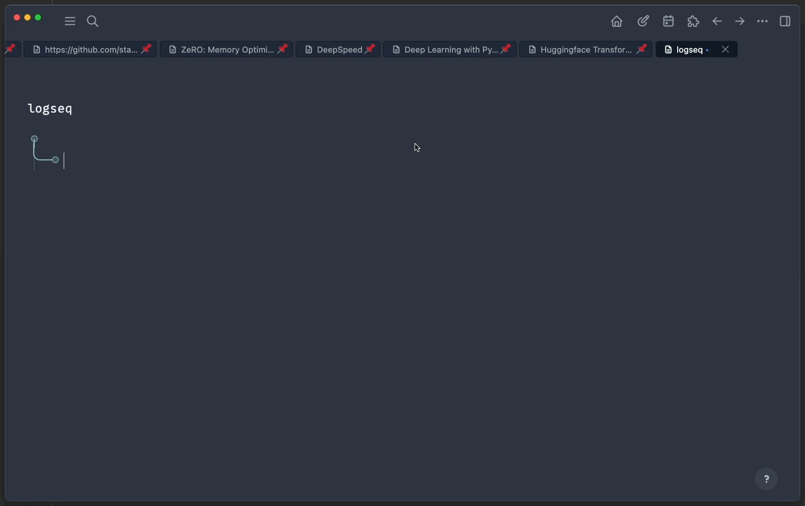
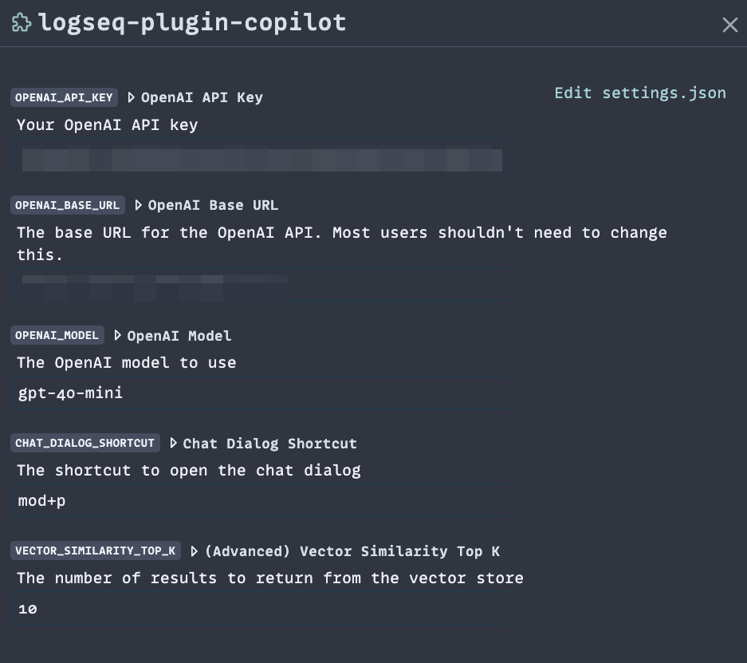

# Logseq Copilot

Talk to AI about your Logseq notes.

## Features

Logseq Copilot automatically indexes all your Logseq notes and includes relevant context in the
ChatGPT prompt. It doesn't matter which page you're currently on, this plugin will pull relevant
information from the entire graph.

Using a chat-like interface, you'll be able to discuss your notes with a Copilot and easily insert
note suggestions into Logseq.

## Usage

Be sure to add your OpenAI API key to the [settings](#settings) page. Without it, this plugin is not
going to work.

Use `ctrl-P` to bring up the Copilot interface and type in a question about your notes.

## Settings

- **OpenAI API Key**: If you don't have one already, create it
  [here](https://platform.openai.com/settings/organization/api-keys)
- **OpenAI Base URL**: If you have a proxy you'd like your OpenAI API calls to go through. If you
  don't know what that is, then you can leave this blank.
- **OpenAI Model**: The actual model the plugin will contact.
- **Chat Dialog Shortcut**: The keyboard shortcut to bring up the chat dialog screen.
- **Vector Similarity Top K**: (Advanced) The number of vector search results that can be included
  in your prompt context.

## Support

Create an issue [here](https://github.com/chhabrakadabra/logseq-plugin-copilot/issues). Even better,
create a pull request!

## License

MIT License
